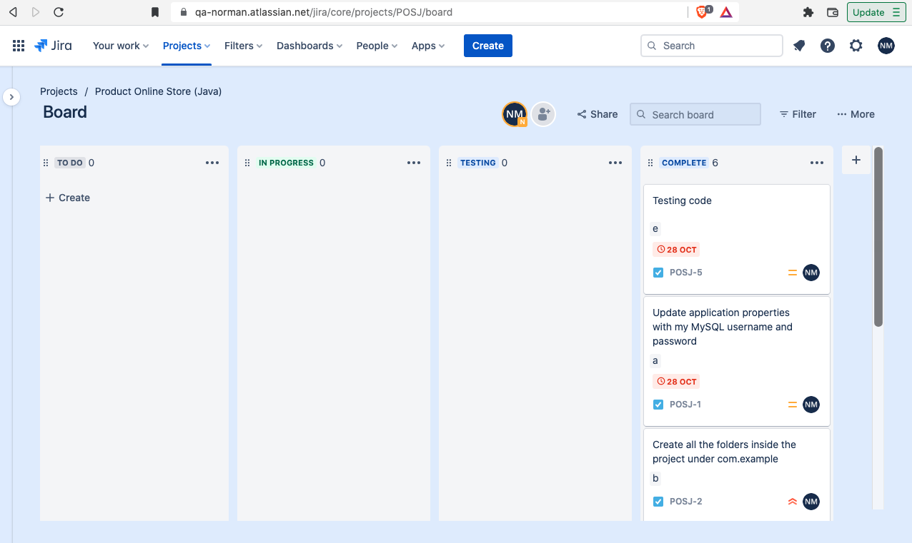
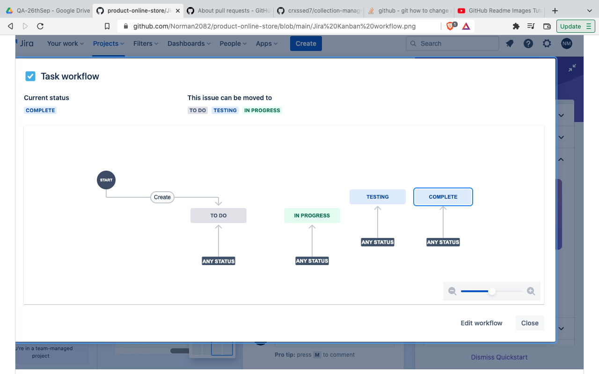
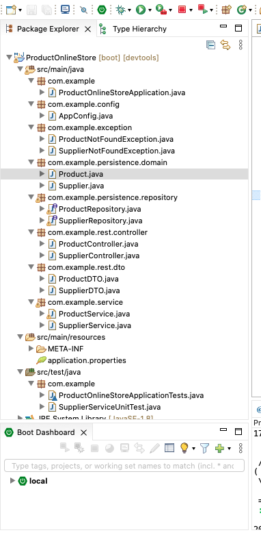
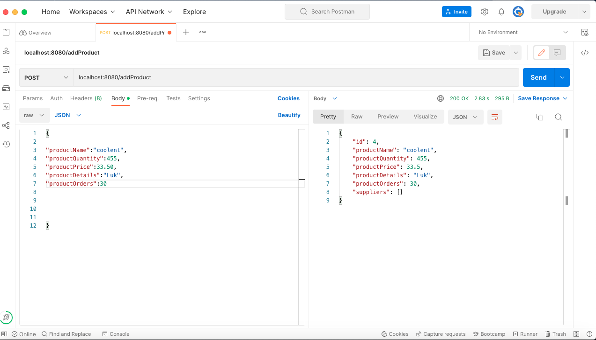
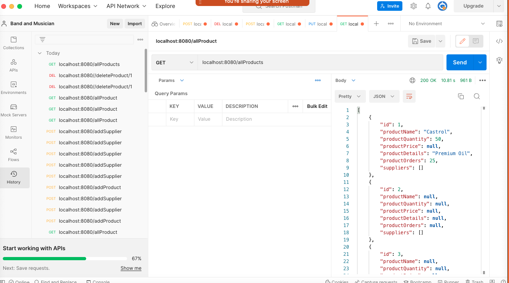
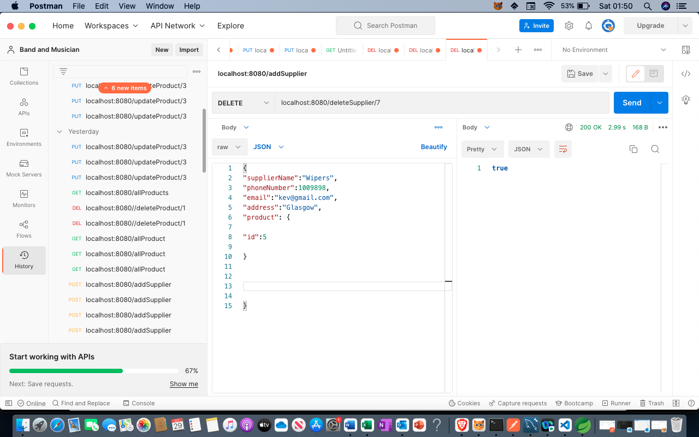
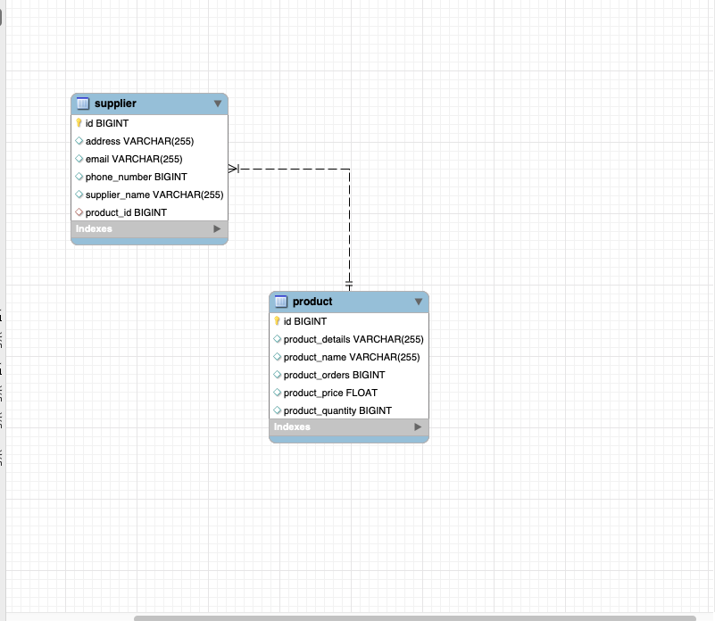

# Product-online-store

A Spring Boot management system which can be utilised in managing products for a small-scale company corporate business. 
The system allows a frontend usability to query a database in a RESTful manner. It has functionalities that allow an individual to Create, Read, 
Update or Delete using the CRUD methodology. Companies can order products from many Suppliers also allowing a backend database 
for suppliers and their contact details if more products where needed. This README will provide a more detailed overview of how the 
App operates.

# Features

* Add product
* Update Product
* View all products 
* Delete product
* View product by Id
* View supplier
* Add supplier
* Delete supplier
* Update supplier
* View all suppliers 

# Software used

* Spring Boot
* Eclipse
* MySQL
* Maven
* Mockito
* JUnit
* Jira
* Java 8

# Project Structure

# Kanban workflow

# Structure

# Postmaster(CRUD)

# Create

# Read

# Update

# Delete

# Database ERD
The diagram shows the relationship between the product and the supplier. The diagram represents a one to many model therefore
one product supplied by many suppliers.

# Tests
Tests were carried out using Mockito/JUnit for creating product, reading product, updating product and deleting product. Although the initial test shown below failed improvements are are still ongoing to rerun the tests so will be updated accordingly. All the tests are located src/test/java/com/example folder.

# Successful tests after code modifications

# Conclusion
Considering that there were a few issues connecting to MySQL server and Postman at the beginning. The problems were solved through analysing the code and making sure the right util imports and dependencies were in place. Looking at the project improvements are underway for future development which will be done by adding more database tables for further categorisation. I would also like to improve my tests.
